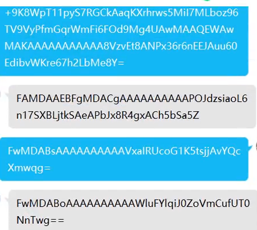
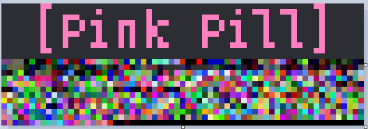
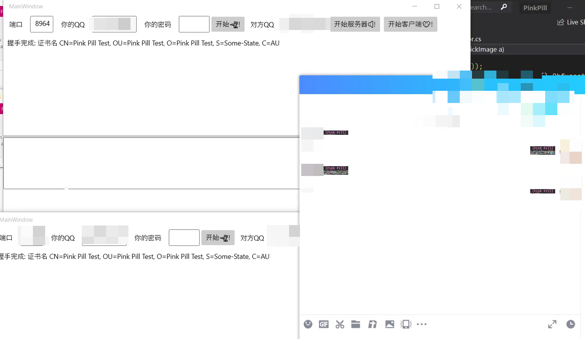
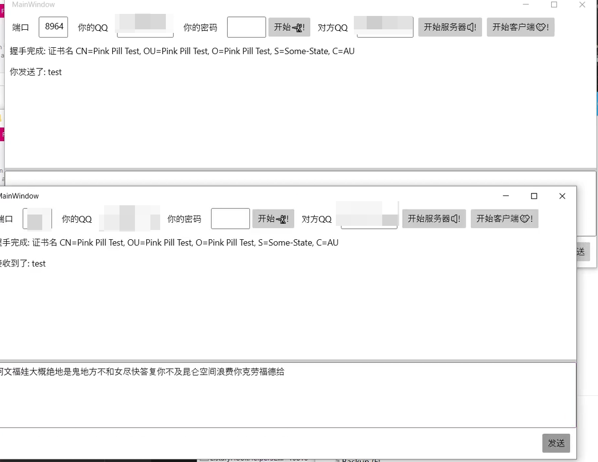

# 🔴+⚪=Pink 💊

本项目是一个原型. 旨在保护现代聊天的隐私.  
当所有聊天内容都被审查, 隐私越来越重要, 只有我们自己能保护隐私.

## Concept

如果我们有能力明文传递消息, 我们为什么不加密传递呢?

有很多加密相关的算法: `AES` `ECDSA` `RSA` `Diffie Hellman`...  
意味着我们有很多路.

- 如果只是要混淆, 可以直接 Base64
- 加密可以用证书, 前提是双方首先通过安全渠道做过了, 在这种情况下, 多个渠道传递证书可能比较安全.　(比如通过 cf workers) 但也不能确保绝对安全, 因为你只有使用这个聊天软件账号的权限, the big brother 可能随时伪装别人和你聊天.
- 如果群聊, 可能需要每个人给每个人交换密钥, 中途有人加入还需要再传递密钥 (可以做到前向安全性). 或者提前都使用同一个密钥. (我不明白加密学, 可能有其他更好的算法) 这其中还得考虑中间人伪造.
- 还可以使用 GPG.  

而这个项目的原型实现了私聊的通信安全.  
我想到使用 TLS 协议做通信安全简直就是完美, 用 C# 写了一个 demo. 看起来像下面这样:

TLS 1.2 握手有 4 次, TLS 上层还得依赖可靠协议, 这里我直接传的 没有包装. _.NET 5 目前在 Windows 20H2 上不支持 TLS 1.3. TLS 1.3 可以把握手包降低至 2 个._  
这里用 Base64 来传递 TLS 的消息.

但是很多聊天软件有最大消息长度限制. 这导致了我上面的握手包差不多要传 20 条消息.

于是我想到了用图片来传递消息, 像这样:

放大一点, 像这样

> _这里没有考虑图片压缩, 我对冗余算法不是很清楚, 目前有一些用 视频来存数据的库, 可以参考_  
> _还可以使用二维码来传递消息_

实现像这样

目前仅仅实现了一个原型.  
数据还可以隐藏在一些普通的图片中.

## Extra

我认为这可以应用到所有的聊天平台. 而且可以用脚本自动化.  
_这里还要考虑前向安全 中间人等等的一堆事情_

## Other

Tenc\*nt 干过很多事, 比如无限法则读取 SS 的配置文件, [客户端读取浏览器消息记录](https://www.v2ex.com/t/745030?p=1), 以及恶心的 Q\*Protect.  
只可惜目前国内聊天几乎被 Tenc\*nt 所垄断.

## License

Anti-996 License.  
我不认为这个项目会违反任何法律, 也不会侵犯任何公司的利益. 在目前, 我还未成年.  
**愿我们在更开放的平行世界相遇.**

0x7943
